# erw-policy-guardian-app
Digitized Policy Workflow for Puro.Earth Standard's Enhanced Rock Weathering (ERW) Methodology Edition 2022 V1, my submission for DLT Climate Hackathon, organised by DLT Science Foundation (DSF), in collaboration with The HBAR Foundation Sustainable Impact Fund.

<!-- TOC -->

- [erw-policy-guardian-app](#erw-policy-guardian-app)
  - [Introduction](#introduction)
  - [Need and Use for the Puro Standard Enhanced Rock Weathering Methodology Policy](#need-and-use-for-the-puro-standard-enhanced-rock-weathering-methodology-policy)
  - [Policy Workflow](#policy-workflow)
  - [Demo](#demo)
  - [Policy Guide](#policy-guide)
    - [Available Roles](#available-roles)
    - [Important Documents \& Schemas](#important-documents--schemas)
    - [Token (Certified Carbon Removal Certificate)](#token-certified-carbon-removal-certificate)
    - [Step by Step Workflow](#step-by-step-workflow)
  - [Next Steps](#next-steps)

<!-- /TOC -->

****

## Introduction

Puro Standard's Enhanced Rock Weathering (ERW) Methodology Edition 2022 V1 is a **framework designed to facilitate the application of crushed silicate rocks to agricultural lands**, leading to the **sequestration of atmospheric carbon dioxide** through accelerated weathering processes. This methodology plays a crucial role in the broader context of climate change mitigation by enhancing carbon dioxide removal from the atmosphere and ensuring its **long-term storage in the form of stable carbonate minerals**.

By adopting the Puro Standard ERW Methodology, Suppliers engage in a systematic approach to applying silicate rock dust to soils, harnessing the natural weathering process to capture and store atmospheric carbon. 

The methodology is supported by robust procedural tools designed for meticulous emission calculations. These instruments account for each step in the **ERW lifecycle—from rock mining and processing to application and reporting**—providing a structured means to quantify the carbon sequestration achieved through the enhanced weathering process.!

## Need and Use for the Puro Standard Enhanced Rock Weathering Methodology Policy

Addressing the urgent need for effective carbon dioxide removal strategies is critical in the face of global climate change. The Puro Standard ERW Methodology offers a promising solution, guiding Suppliers in the application of silicate rock dust to agricultural soils, thereby accelerating the natural weathering process and sequestering atmospheric carbon. 

The process involves **rigorous lifecycle assessments, ensuring that the carbon dioxide removed from the atmosphere is securely locked in stable mineral forms, effectively removing it from the carbon cycle for extended periods**. This policy not only represents an innovative approach to carbon removal but also aligns with the global efforts to achieve net-zero emissions and mitigate the impacts of climate change.

Through digitization, the methodology becomes **more accessible and efficient, enabling transparent and accurate emissions reporting, project monitoring, and certification processes**. It integrates digital tools that facilitate the management of ERW activities, ensuring data integrity and ease of policy compliance.

## Policy Workflow

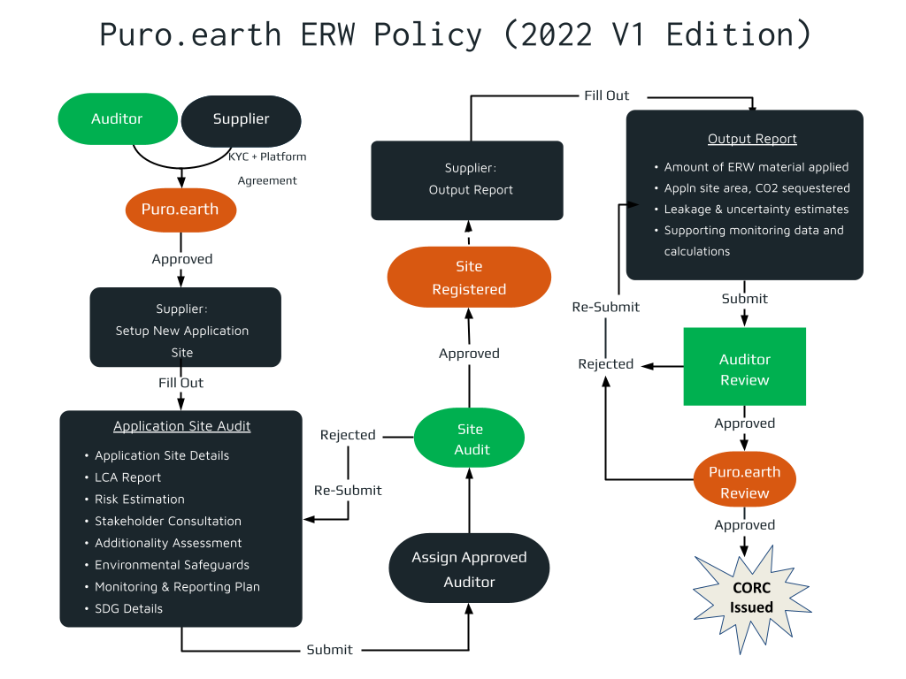

## Demo

## Policy Guide

This policy guide provides an operational manual for implementing the Puro Standard ERW Methodology within the digital Guardian App ecosystem. It specifies each role's responsibilities, essential documents, and the procedural workflow, facilitating compliance and efficiency in achieving certified carbon removal.

First version (v0.1.1) is published under the topic [0.0.3989609](https://explore.lworks.io/testnet/topics/0.0.3989609) on testnet, it can also be imported via the `.policy` file in the policy folder.

### Available Roles 

- **Supplier**: Manages the ERW application site, adheres to Puro Standard methodology, and produces detailed reports and documentation for audit and certification.
- **Third-Party Auditor**: Independently assesses and verifies the supplier's documentation and reports, ensuring compliance with the Puro Standard methodology.
- **Puro.earth Registry**: Manages the registration, issuance, and tracking of Certified Carbon Removal Certificates (CORCs), ensuring integrity and transparency in the certification process.

### Important Documents & Schemas 

- **KYC Documentation**: To verify supplier identity and legitimacy.
- **Platform Agreement**: Detailing the agreement terms between the supplier and the registry.
- **Application Site Registration**: For registering new ERW application sites.
- **Application Site Audit Documentation**: Comprehensive reports demonstrating ERW process compliance.
  - Application Site Details
  - LCA & CORC Estimations
    - Rock Mining and Processing Emission Details  
    - Rock Dust Transportation Emission Details
    - Rock Dust Application Emission Details
- **Output Report**: Detailed periodic reports on ERW application and environmental impact.

### Token (Certified Carbon Removal Certificate)

Each CORC is a token representing one metric ton of CO2 sequestered through enhanced rock weathering as verified by Puro Standard's methodology.

### Step by Step Workflow

1. Role Selection
- Users begin by selecting their role: either as a **Supplier** or as an **Auditor**.

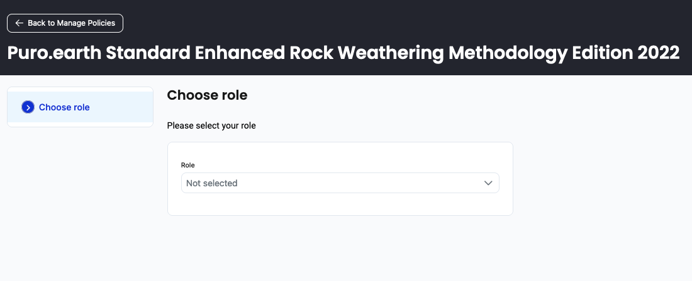  

2. Profile Approval

- **Suppliers** and **Auditors** submit their profiles for approval. Suppliers must provide KYC documentation & Platform agreement to register.

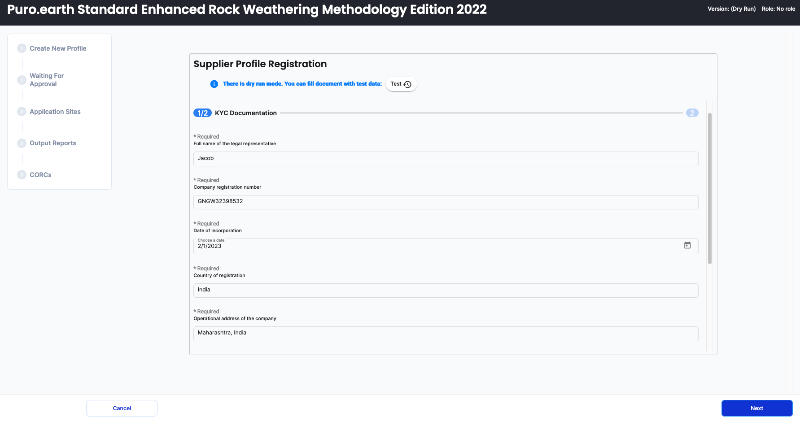  
  

- The **Puro.earth Registry** review the information provided as Verified Credentials, and approves the profiles, granting access to the platform's functions.

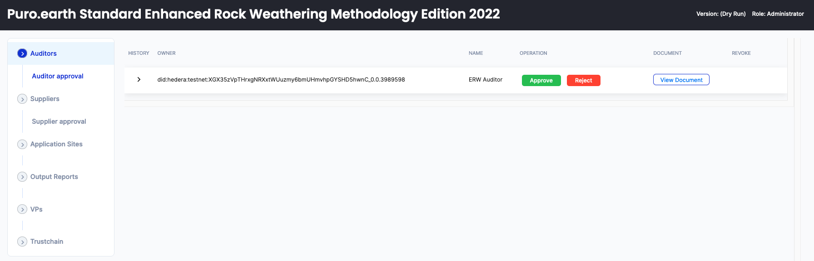

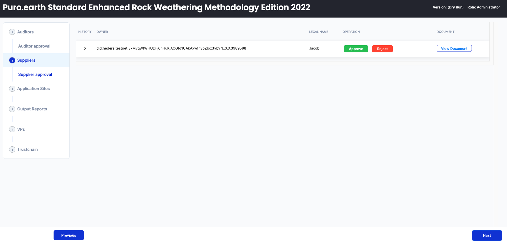  

3. Application Site Registration

- The **Supplier** registers a new ERW application site, providing all necessary details about the rock dust source, application process, lifecycle assessment, and intended monitoring plan.

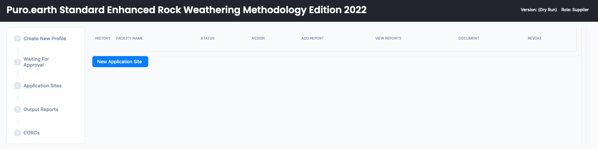  

- **New application site details**

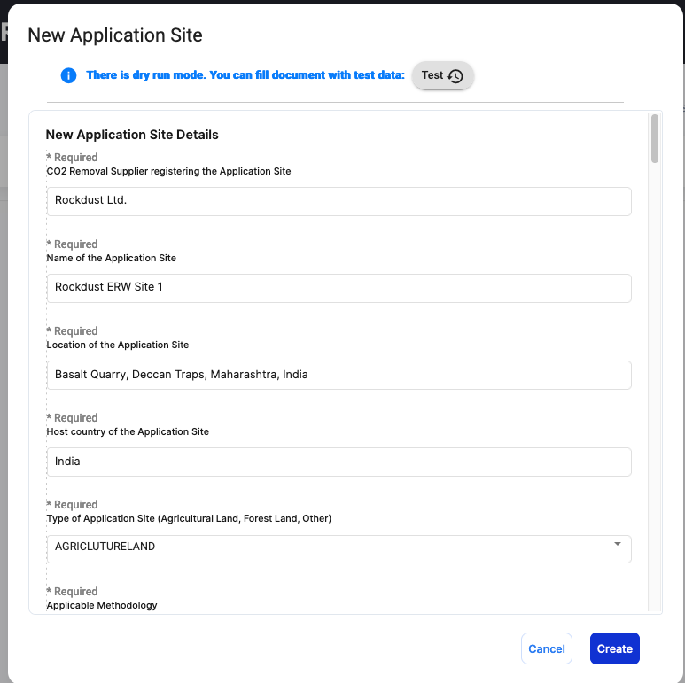  

- **Application Site Soil details**

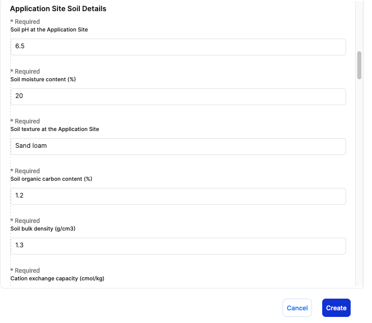  

- **Weathering Material Details**

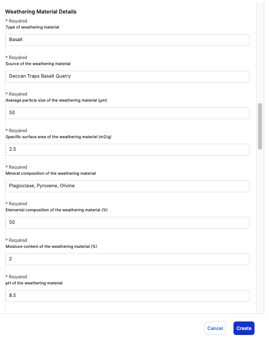  

- **Life-Cycle Assessment (LCA) Report and CORC estimations**

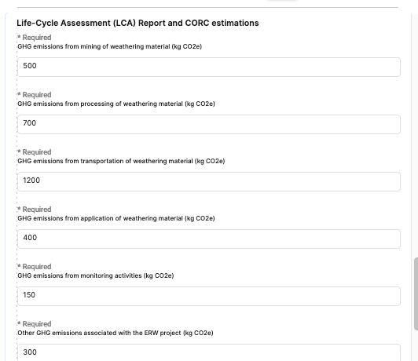  

- **Additional Assessment Report**

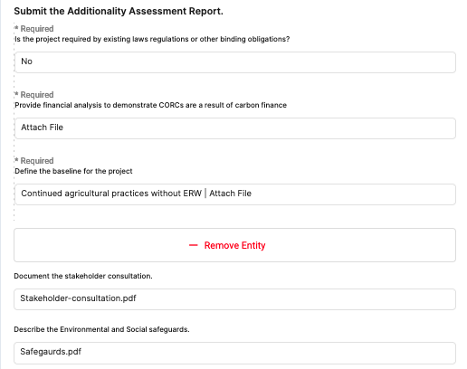 

- **SDG Impacts**

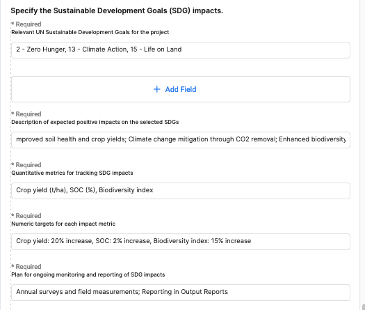  

4. Application Site Audit 

- Once the application site is registered, it is subject to an audit. Supplier can assign an approved auditor to the registered site.  

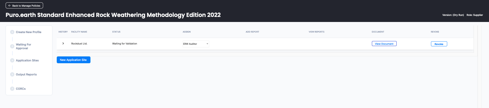  

- The **Auditor** reviews the application site's registration details and the **Application Site Audit Documentation** to ensure compliance with the **Puro Standard ERW Methodology**.

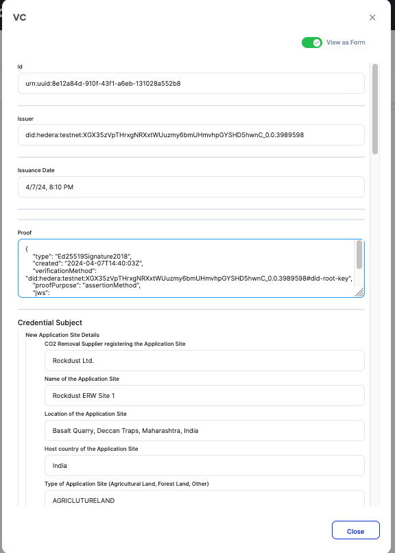  

5. Audit Approval

- After a thorough review, the **Auditor** approves the application site, confirming it meets the necessary criteria for ERW implementation.

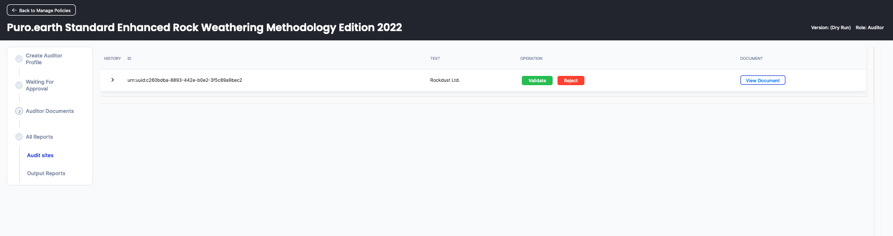  

6. ERW Commencement 

- Following audit approval, the **Supplier** can begin ERW application at the site.

7. Output Report Submission

- For a specified monitoring period, the **Supplier** is required to submit **Output Reports**. 

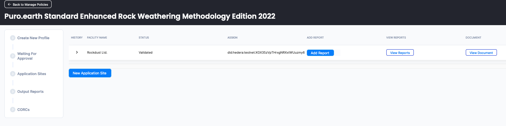  

- These reports detail the ERW material applied at the Application site, estimated carbon sequestration, leakage and uncertainty estimations, and supporting calculations.

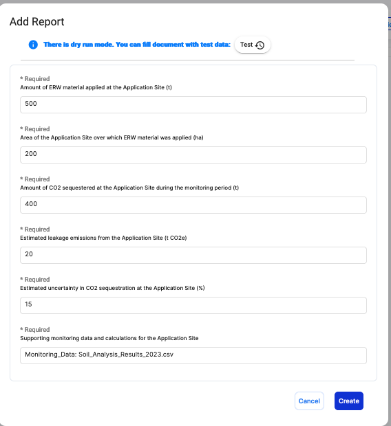  

8. Output Report Verification

- The **Auditor** receives and verifies the **Output Reports** to confirm the accuracy and integrity of the reported data.

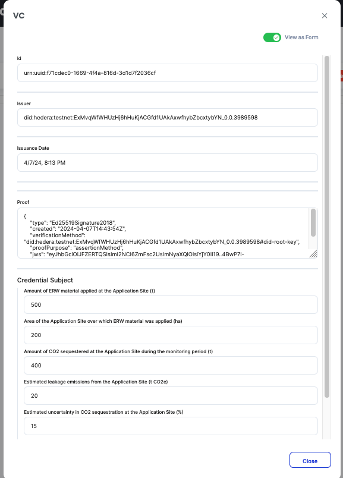  
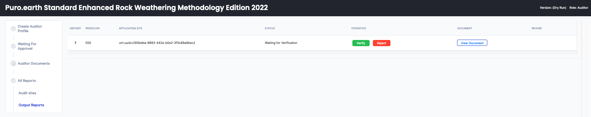  

9. Verification, Validation, and CORC Issuance

- After successful verification by the **Auditor**, the **Registry** validates the reports.

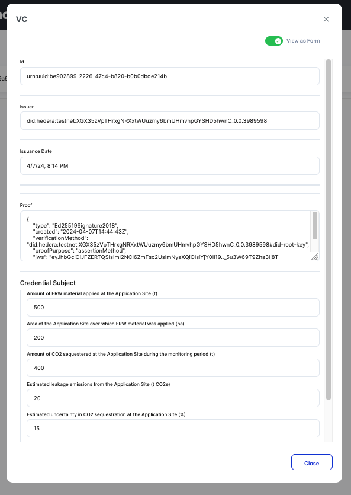  

- Upon validation, the **Registry** issues **CORCs**, which represent the net carbon removal achieved through the Supplier's ERW application.

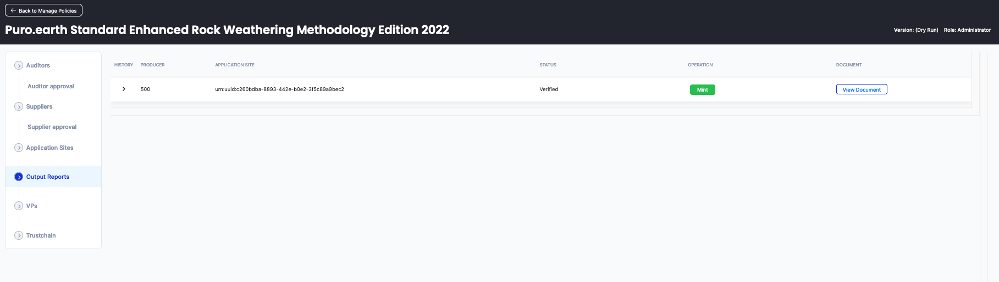  

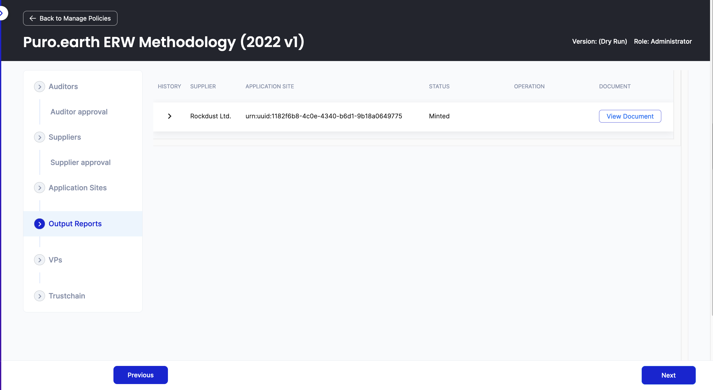  

10.   Trust Chain Visibility

- The entire process is recorded in a trust chain, providing a transparent and immutable record of the ERW application and certification process.  
- Stakeholders can view the trust chain to ensure the integrity and validity of the ERW's carbon sequestration credentials.

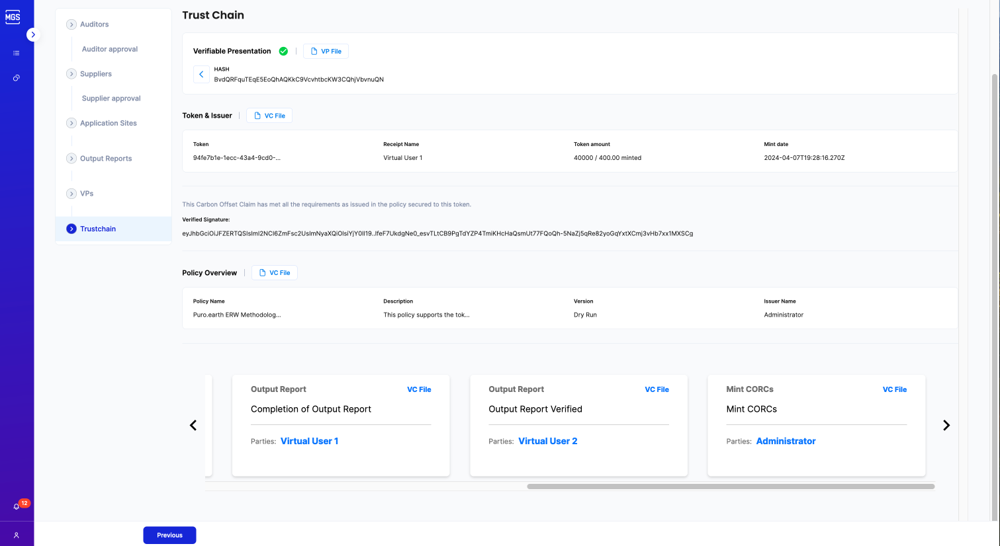  

## Next Steps
- Support automatic calculation of CORCs based on input LCA emission details  
- Robust policy navigation for each of the roles
- Improved schemas to capture granular details of SCR & SDGs
- Comparative analysis with other ERW methodologies